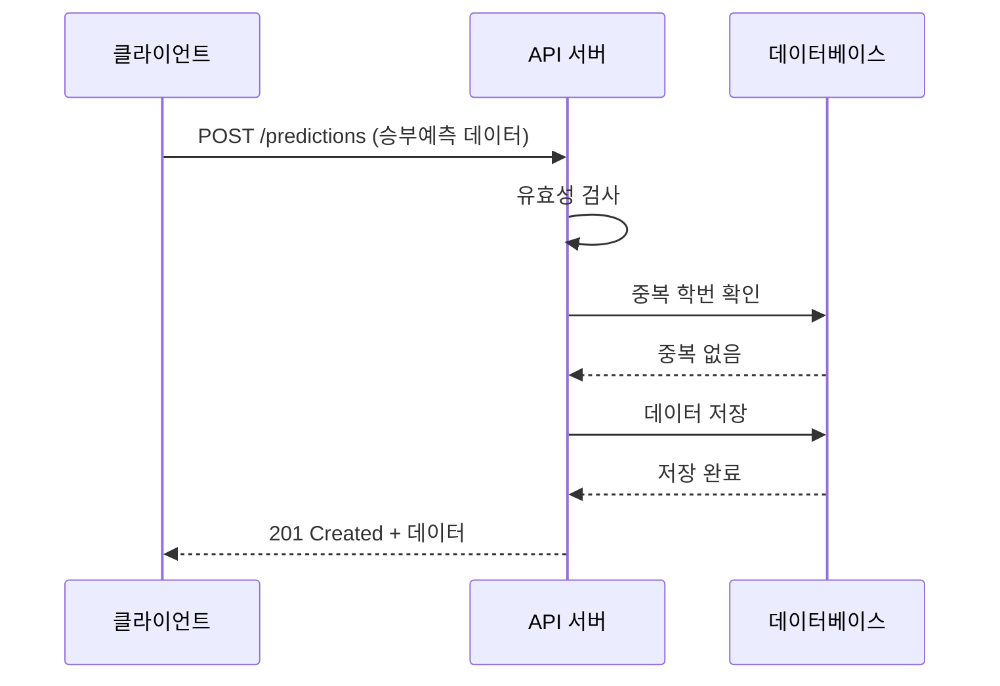
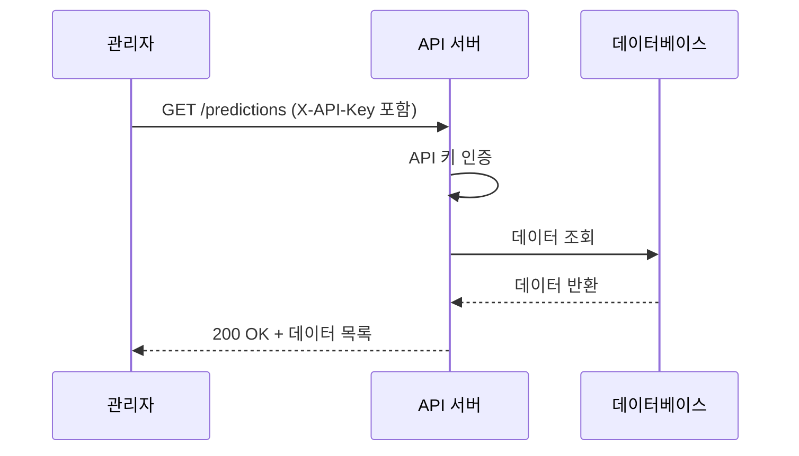

# 승부예측 API 사용법

## 개요
학생들의 승부예측을 받는 API입니다. 이름, 학번, 전화번호와 1등, 2등, 3등 학과를 저장합니다.

## 데이터 모델

### Prediction (승부예측)
```typescript
interface Prediction {
  id: number;                    // 고유 식별자 (자동 생성)
  name: string;                  // 학생 이름
  student_id: string;            // 학번 (10자리, 고유값)
  phone: string;                 // 전화번호
  first_place: string;           // 1등 학과
  second_place: string;          // 2등 학과
  third_place: string;           // 3등 학과
  created_at: string;            // 생성 시간 (ISO 8601)
  updated_at: string;            // 수정 시간 (ISO 8601)
}
```

### 데이터베이스 스키마
```sql
CREATE TABLE predictions (
  id BIGSERIAL PRIMARY KEY,           -- 자동 증가 ID
  name TEXT NOT NULL,                 -- 이름 (필수)
  student_id TEXT NOT NULL UNIQUE,    -- 학번 (필수, 고유)
  phone TEXT NOT NULL,                -- 전화번호 (필수)
  first_place TEXT NOT NULL,          -- 1등 학과 (필수)
  second_place TEXT NOT NULL,         -- 2등 학과 (필수)
  third_place TEXT NOT NULL,          -- 3등 학과 (필수)
  created_at TIMESTAMPTZ DEFAULT NOW(), -- 생성 시간
  updated_at TIMESTAMPTZ DEFAULT NOW()  -- 수정 시간
);
```

## API 엔드포인트

### 1. 승부예측 제출
**POST** `/predictions`

#### 요청 본문 (JSON)
```json
{
  "name": "홍길동",
  "student_id": "2024200072",
  "phone": "010-1234-5678",
  "first_place": "컴퓨터공학과",
  "second_place": "전자공학과",
  "third_place": "기계공학과"
}
```

#### 응답 예시
```json
{
  "message": "승부예측 제출 완료",
  "data": {
    "id": 1,
    "name": "홍길동",
    "student_id": "2024200072",
    "first_place": "컴퓨터공학과",
    "second_place": "전자공학과",
    "third_place": "기계공학과",
    "created_at": "2024-01-15T10:30:00.000Z"
  }
}
```

### 2. 승부예측 목록 조회 (관리자 전용)
**GET** `/predictions?page=1&limit=10`

#### 헤더
- `X-API-Key`: 관리자 API 키 (필수)

#### 쿼리 파라미터
- `page`: 페이지 번호 (기본값: 1)
- `limit`: 페이지당 항목 수 (기본값: 10, 최대: 50)

#### 응답 예시
```json
{
  "page": 1,
  "limit": 10,
  "total": 25,
        "items": [
        {
          "id": 1,
          "name": "홍길동",
          "student_id": "2024200072",
          "phone": "010-1234-5678",
          "first_place": "컴퓨터공학과",
          "second_place": "전자공학과",
          "third_place": "기계공학과",
          "created_at": "2024-01-15T10:30:00.000Z"
        }
      ]
}
```

#### 인증 실패 시 응답
```json
{
  "message": "관리자 인증이 필요합니다."
}
```

### 3. 개별 승부예측 조회 (관리자 전용)
**GET** `/predictions/:id`

#### 헤더
- `X-API-Key`: 관리자 API 키 (필수)

#### 응답 예시
```json
{
          "data": {
          "id": 1,
          "name": "홍길동",
          "student_id": "2024200072",
          "phone": "010-1234-5678",
          "first_place": "컴퓨터공학과",
          "second_place": "전자공학과",
          "third_place": "기계공학과",
          "created_at": "2024-01-15T10:30:00.000Z"
        }
}
```

#### 인증 실패 시 응답
```json
{
  "message": "관리자 인증이 필요합니다."
}
```

## 유효성 검사 규칙

### 필수 필드 검증
| 필드 | 타입 | 제약 조건 | 예시 |
|------|------|-----------|------|
| `name` | string | 필수, 공백 제거 후 1자 이상 | `"홍길동"`, `"김철수"` |
| `student_id` | string | 필수, 정확히 10자리 숫자 | `"2024200072"`, `"2024200073"` |
| `phone` | string | 필수, 010-XXXX-XXXX 형식 | `"010-1234-5678"`, `"010-9876-5432"` |
| `first_place` | string | 필수, 공백 제거 후 1자 이상 | `"컴퓨터공학과"`, `"전자공학과"` |
| `second_place` | string | 필수, 공백 제거 후 1자 이상 | `"기계공학과"`, `"화학공학과"` |
| `third_place` | string | 필수, 공백 제거 후 1자 이상 | `"건축공학과"`, `"토목공학과"` |

### 상세 검증 규칙

#### 1. 이름 (name)
- **필수**: 반드시 제공되어야 함
- **길이**: 공백 제거 후 최소 1자 이상
- **타입**: 문자열만 허용
- **예시**: `"홍길동"`, `"김철수"`, `"이영희"`

#### 2. 학번 (student_id)
- **필수**: 반드시 제공되어야 함
- **형식**: 정확히 10자리 숫자
- **정규식**: `^\\d{10}$`
- **예시**: `"2024200072"`, `"2024200073"`, `"2024200074"`
- **제한**: 이미 제출된 학번은 중복 제출 불가

#### 3. 전화번호 (phone)
- **필수**: 반드시 제공되어야 함
- **형식**: `010-XXXX-XXXX` (하이픈 포함)
- **정규식**: `^010-\\d{4}-\\d{4}$`
- **예시**: `"010-1234-5678"`, `"010-9876-5432"`

#### 4. 학과 순위 (first_place, second_place, third_place)
- **필수**: 모든 순위가 반드시 제공되어야 함
- **길이**: 공백 제거 후 최소 1자 이상
- **중복 금지**: 1등, 2등, 3등 학과는 모두 달라야 함
- **검증 로직**: 
  ```javascript
  const places = [first_place, second_place, third_place];
  const uniquePlaces = [...new Set(places)];
  if (uniquePlaces.length !== 3) {
    // 오류: 중복 학과 존재
  }
  ```

### 비즈니스 로직 제약
1. **중복 제출 방지**: 같은 학번으로는 한 번만 제출 가능
2. **데이터 무결성**: 1등, 2등, 3등 학과는 모두 달라야 함
3. **순서 제약**: 1등, 2등, 3등 순서대로 입력해야 함

## API 응답 형식

### 성공 응답 공통 형식
```typescript
interface SuccessResponse<T> {
  message?: string;           // 성공 메시지 (선택적)
  data?: T;                  // 응답 데이터 (선택적)
  page?: number;             // 페이지 번호 (목록 조회 시)
  limit?: number;            // 페이지당 항목 수 (목록 조회 시)
  total?: number;            // 전체 항목 수 (목록 조회 시)
  items?: T[];               // 항목 배열 (목록 조회 시)
}
```

### 에러 응답 공통 형식
```typescript
interface ErrorResponse {
  message: string;            // 에러 메시지
  errors?: string[];          // 유효성 검사 오류 목록 (선택적)
  error?: string;             // 서버 오류 상세 내용 (선택적)
}
```

## HTTP 상태 코드

### 성공 응답
- **200 OK**: 요청 성공 (목록/개별 조회)
- **201 Created**: 리소스 생성 성공 (승부예측 제출)

### 클라이언트 오류
- **400 Bad Request**: 요청 형식 오류 또는 유효성 검사 실패
- **401 Unauthorized**: 인증 실패 (관리자 API 키 누락 또는 불일치)
- **404 Not Found**: 요청한 리소스를 찾을 수 없음
- **409 Conflict**: 리소스 충돌 (중복 학번 제출)

### 서버 오류
- **500 Internal Server Error**: 서버 내부 오류

## 에러 응답 상세

### 400 Bad Request (유효성 오류)
```json
{
  "message": "유효성 오류",
      "errors": [
      "name은(는) 필수입니다.",
      "student_id는 10자리 숫자여야 합니다.",
      "phone 형식이 올바르지 않습니다. (예: 010-1234-5678)",
      "first_place는(은) 필수입니다.",
      "second_place는(은) 필수입니다.",
      "third_place는(은) 필수입니다.",
      "1등, 2등, 3등 학과는 모두 달라야 합니다."
    ]
}
```

### 401 Unauthorized (인증 실패)
```json
{
  "message": "관리자 인증이 필요합니다."
}
```

### 404 Not Found (리소스 없음)
```json
{
  "message": "존재하지 않습니다."
}
```

### 409 Conflict (중복 제출)
```json
{
  "message": "이미 제출된 학번입니다. 한 번만 제출 가능합니다."
}
```

### 500 Internal Server Error (서버 오류)
```json
{
  "message": "서버 오류",
  "error": "데이터베이스 연결 실패"
}
```

## 데이터베이스 설정

Supabase에서 다음 SQL을 실행하여 테이블을 생성하세요:

```sql
-- supabase_setup.sql 파일의 내용을 Supabase SQL Editor에서 실행
```

### 예시 데이터
테이블 생성 후 자동으로 삽입되는 예시 데이터:
- **이제호** (2023202076): 컴퓨터정보공학부 → 소프트웨어학부 → 미디어커뮤니케이션학부
- **김철수** (2024200072): 소프트웨어학부 → 컴퓨터정보공학부 → 미디어커뮤니케이션학부
- **이영희** (2024200073): 미디어커뮤니케이션학부 → 소프트웨어학부 → 컴퓨터정보공학부
- **박민수** (2024200074): 전자공학부 → 기계공학부 → 화학공학부
- **정수진** (2024200075): 기계공학부 → 전자공학부 → 화학공학부
- **최동현** (2024200076): 화학공학부 → 기계공학부 → 전자공학부
- **한미영** (2024200077): 건축공학부 → 토목공학부 → 산업공학부
- **윤성준** (2024200078): 토목공학부 → 건축공학부 → 산업공학부
- **송지은** (2024200079): 산업공학부 → 건축공학부 → 토목공학부
- **강현우** (2024200080): 환경공학부 → 신소재공학부 → 생명공학부
```

## 테스트 예시

### cURL을 사용한 테스트
```bash
# 승부예측 제출
curl -X POST http://localhost:3000/predictions \
  -H "Content-Type: application/json" \
  -d '{
    "name": "김철수",
    "student_id": "2024200073",
    "phone": "010-9876-5432",
    "first_place": "전자공학과",
    "second_place": "기계공학과",
    "third_place": "컴퓨터공학과"
  }'

# 목록 조회 (관리자 전용)
curl -H "X-API-Key: kwu_admin_2024_xyz123abc456def789" \
  http://localhost:3000/predictions?page=1&limit=5

# 개별 조회 (관리자 전용)
curl -H "X-API-Key: kwu_admin_2024_xyz123abc456def789" \
  http://localhost:3000/predictions/1
```

### JavaScript/Fetch를 사용한 테스트
```javascript
// 승부예측 제출
const response = await fetch('/predictions', {
  method: 'POST',
  headers: {
    'Content-Type': 'application/json',
  },
  body: JSON.stringify({
    name: '김철수',
    student_id: '2024200073',
    phone: '010-9876-5432',
    first_place: '전자공학과',
    second_place: '기계공학과',
    third_place: '컴퓨터공학과'
  })
});

const result = await response.json();
console.log(result);
```

## 환경변수 설정

API를 사용하기 전에 프로젝트 루트에 `.env` 파일을 생성하고 다음 환경변수를 설정해야 합니다:

### 1. .env 파일 생성
```bash
# 프로젝트 루트에 .env 파일 생성
touch .env  # Linux/Mac
# 또는 Windows에서는 .env 파일을 직접 생성
```

### 2. 환경변수 설정
```bash
# .env 파일 내용
SUPABASE_URL=your_supabase_url_here
SUPABASE_ANON_KEY=your_supabase_anon_key_here
ADMIN_API_KEY=your_secure_admin_api_key_here
PORT=3000
```

### 3. ADMIN_API_KEY 생성 방법
승부예측 데이터 조회를 위한 관리자 전용 API 키입니다. 다음 방법 중 하나로 생성하세요:

#### 방법 1: 직접 생성 (권장)
```bash
# 예시 키들
ADMIN_API_KEY=kwu_admin_2024_xyz123abc456def789
ADMIN_API_KEY=kwu_council_secret_key_2024_secure
ADMIN_API_KEY=admin_kwu_student_council_52_2024
```

#### 방법 2: Node.js로 랜덤 생성
```bash
# 터미널에서 실행
node -e "console.log('kwu_admin_' + Math.random().toString(36).substring(2, 15) + '_' + Date.now().toString(36))"
```

#### 방법 3: 온라인 생성기
- [Random.org](https://www.random.org/strings/)
- [UUID Generator](https://www.uuidgenerator.net/)

### 4. 보안 요구사항
- **길이**: 최소 20자 이상
- **복잡성**: 영문, 숫자, 특수문자 조합
- **보안**: 절대 공개하지 말고 정기적으로 변경
- **저장**: 소스코드에 하드코딩 금지, 항상 환경변수로 관리

### 5. 서버 실행
환경변수 설정 후 서버를 실행하세요:

```bash
# 개발 모드로 실행
npm start

# 또는 직접 실행
node api/index.js
```

### 6. 환경변수 확인
서버 실행 전 환경변수가 제대로 설정되었는지 확인:

```bash
# Windows PowerShell
echo $env:ADMIN_API_KEY

# Windows CMD
echo %ADMIN_API_KEY%

# Linux/Mac
echo $ADMIN_API_KEY
```

## API 사용 시나리오

### 1. 정상적인 승부예측 제출


### 2. 관리자 데이터 조회


## 예외 처리 및 오류 시나리오

### 1. 유효성 검사 실패
- **원인**: 필수 필드 누락, 형식 오류, 중복 학과
- **응답**: 400 Bad Request + 상세 오류 목록
- **처리**: 클라이언트에서 올바른 데이터로 재시도

### 2. 중복 제출 시도
- **원인**: 이미 제출된 학번으로 재제출
- **응답**: 409 Conflict + 중복 제출 안내
- **처리**: 다른 학번으로 제출하거나 기존 데이터 확인

### 3. 관리자 인증 실패
- **원인**: API 키 누락, 잘못된 API 키
- **응답**: 401 Unauthorized + 인증 필요 안내
- **처리**: 올바른 API 키로 재시도

### 4. 서버 오류
- **원인**: 데이터베이스 연결 실패, 시스템 오류
- **응답**: 500 Internal Server Error + 오류 상세
- **처리**: 잠시 후 재시도 또는 관리자 문의

## 주의사항

1. **중복 제출 방지**: 같은 학번으로는 한 번만 제출할 수 있습니다
2. **데이터 무결성**: 1등, 2등, 3등 학과는 모두 달라야 합니다
3. **개인정보 보호**: 전화번호는 암호화되지 않으므로 필요시 추가 보안 조치를 고려하세요
4. **CORS 설정**: 허용된 도메인에서만 API 호출이 가능합니다
5. **보안**: GET API는 관리자 API 키가 필요합니다
6. **데이터 백업**: 중요한 데이터는 정기적으로 백업 요망
7. **모니터링**: API 사용량과 오류를 모니터링
